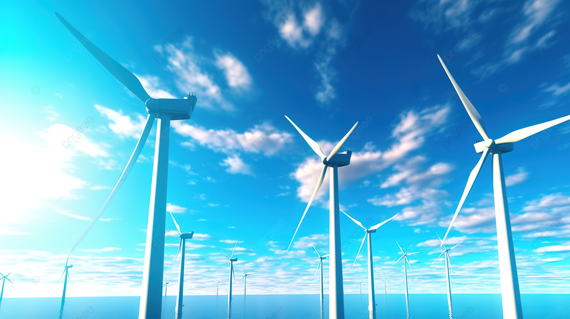
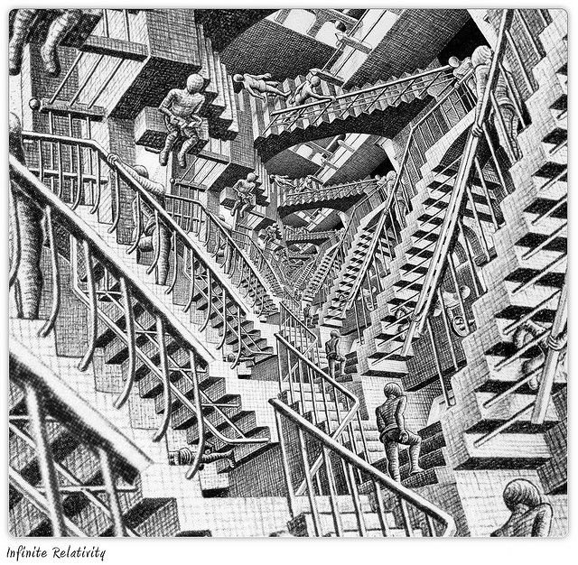
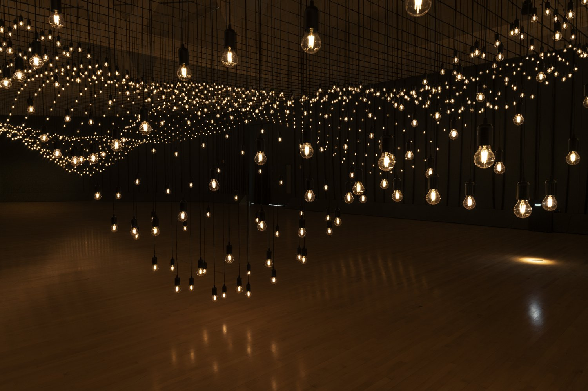

# Reflective Report on Dynamic Animated Circles Project

## Introduction

This project, developed using p5.js, showcases a series of dynamic animated circles on a digital canvas. The animations are driven by principles observed in natural phenomena and refined through artistic expression, making coding accessible and engaging for artists, designers, educators, and beginners alike.

## Project Overview

This interactive artwork features a series of dynamic circles that move, rotate, and scale based on time. Each circle consists of multiple layers, with smaller circles embedded within, creating a visually rich, layered effect.

### Interaction Guide

- **Page Loading**: Upon loading the web page, the animation automatically initiates. The dynamic behavior of the circles can be observed without any user interaction.
- **Animation Duration**: The animation runs continuously, with the circles scrolling endlessly across the screen. This movement is complemented by rotational and scaling transformations that add depth and interest.

## Project Visual Inspirations

Our project draws inspiration from a variety of sources, reflecting the intersection of natural dynamics and artistic innovation.

### Windmill Movement Inspiration

*The graceful and continuous movements of windmills inspired the rotational aspects of our animations, reflecting the synergy between mechanical motion and natural wind flows.*

### Breathing Rhythm Visualization

*The natural expansion and contraction found in breathing rhythms are mimicked in our scaling animations, providing a visual representation of life's essential rhythm.*

### M.C. Escher's Artwork

*Escher's exploration of infinite loops and complex symmetries has deeply influenced our approach to creating repetitive and engaging patterns.*

### Interactive Art Installation

*This installation by Rafael Lozano-Hemmer, where audience movements dynamically influence the art display, parallels our project's interactivity features.*

## Animation Method

### Animation Drive

The animations are time-based, utilizing timers and events within the `p5.js` `draw()` function to dynamically update the properties of each circle.

### Animated Properties

- **Horizontal Scrolling**: Circles scroll horizontally across the screen, seamlessly re-entering from the left as they exit on the right.
- **Rotation**: Each circle rotates around its center, adding a layer of complexity to the visual display.
- **Scaling**: The circles periodically increase and decrease in size, simulating the natural rhythm of breathing which enhances the visual engagement.

## Differences from Other Works

Unlike projects from other group members that might focus on single effects such as color changes or partial display of elements, this project integrates multiple dynamic effects:
- Combining scrolling, rotation, and scaling to create a more complex and engaging viewer experience.
- Continuous and smooth dynamic changes enhance viewer engagement more effectively than simpler visual modifications.

## Animation Inspiration

The design and implementation of the animations are inspired by the continuous movement and rhythmic patterns observed in windmills and breathing, respectively. These natural phenomena exemplify dynamic and harmonious aesthetics, guiding our animation strategies and choices.

## Technical Explanation

The technical implementation involves using `p5.js` to adjust the x-coordinate, rotation angle, and scale factor of each circle based on time calculations from `millis()`. This approach ensures smooth and continuous animations that are visually appealing and dynamically responsive.

## References and Acknowledgments

We extend our gratitude to the `p5.js` community, whose extensive resources and documentation have been invaluable. This JavaScript library is instrumental in enabling artists and programmers to explore creative coding, making it possible to realize such visually intricate projects.

